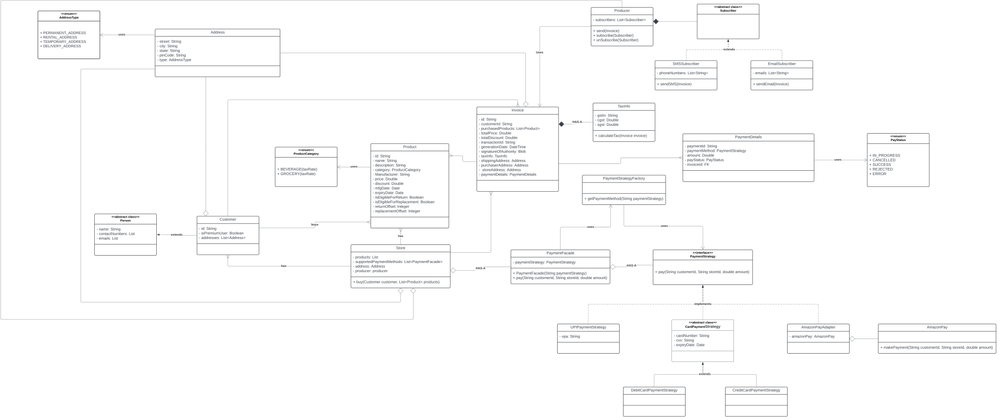

# Billing System
by Gaurav Kabra

### Design
Below system uses:
- Factory design pattern
- Strategy design pattern
- Facade design pattern
- Adapter design pattern
- Observer design pattern

Please go over the <a href="https://github.com/kabragaurav/gof-design-patterns">GOF Design Patterns Repo</a> to be familiar with the design patterns.

### Validations
- Discount cannot be more than price of product
- Not more than two phone number and email addresses can be registered at a time in Customer profile
- Extensible to new Payment methods (Facade)
- Some products may not be eligible for return/replacement. In that case, return date offset or replacement date offset will be null.
- finalPrice in Invoice need not be stored and will be derivable from price and discount as `finalPrice = price - discount`
- There can be multiple pays done by customer for an invoice. Partially by UPI, partially by credit card.
- An invoice is printed only when PayStatus for all transactions is SUCCESS.
- Payment can fail due to cancelled by user, rejected by bank (daily limit, suspected theft, insufficient balance) or errored due to incorrect details.
- As soon as invoice is generated, using customerId, details are sent over SMS/WhatsApp/Email.
- Max size of String and max size and type of Blob.